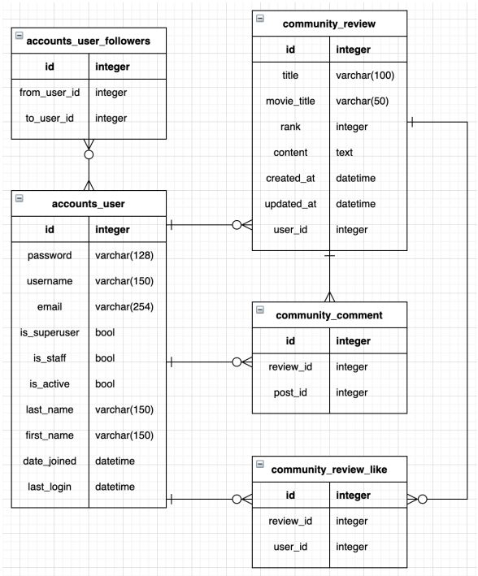

# SSAFY Final Project


[1. Short Description](#1.-Short-Description)

[2. Installation](#2.-Installation)

[3. Long Description](#3.-Long-Description)


## **1. Short Description**

> 서비스 소개


 기반으로 작성된 영화 리뷰 및 추천 기능을 담은 커뮤니티 사이트


**홈 화면**


- 검색 기능
  - 궁금한 영화를 검색하여 정보(리뷰, 평점 등) 조회 가능
- 회원 가입 기능
  - 가입하거나 로그인하여 커뮤니티 기능 및 리뷰 작성, 추천 기능 이용 가능
- 손님으로 로그인 기능
  - 회원가입하지 않고 영화 추천 기능 이용 가능


**영화 추천 기능**


- 추천 영화 목록
  - 로그인이 되어 있는 경우: 사용자가 남긴 **리뷰에 기반하여 추천**
  - 로그인 되어 있지 않은 경우: TMDB 별점 상위 10개 영화 리스트를 제공
- 영화 상세 정보 조회
  - 추천 영화 목록에서 포스터를 클릭하거나, 우측 상단 검색을 통해 조회 가능
  - 영화 줄거리, 포스터, 다른 이용자의 리뷰, 예고편(Youtube API) 제공
- 본인이 남긴 리뷰 기반 장르별 영화 추천
  - 사용자가 리뷰를 많이 남긴 장르의 영화를 TMDB 별점순으로 정렬하여 제공


**커뮤니티 기능**


- 계정 생성, 조회, 수정, 삭제 기능(CRUD)
  - 다른 이용자가 남긴 리뷰를 조회하고 follow 할 수 있음
- 영화별로 리뷰 작성, 조회, 수정, 삭제
- 각 리뷰 별로 코멘트 및 추천 작성 가능
  - 다른 이용자의 리뷰에 댓글을 달거나 좋아요를 누를 수 있음


## 2. Installation

> 구현된 웹 사이트를 보기 위해 설치가 필요한 항목 소개
>
> 배포하지 않았기 때문에 실제 웹사이트를 로컬 환경에서 조작하기 위해서는 실행 순서를 따라야 함


### 2.1. Used Module

프로젝트에서 사용된 주요 모듈은 다음과 같다

```
Python

Django

Bootstrap4

django-imagekit

requests
```


### 2.2. 실행 순서


#### 1. 모듈 설치

실행을 하기 위해서는 먼저 레퍼지토리를 clone한 후 fin_pjt 폴더로 이동하여

- 위 2.1. Used Module에서 언급된 모듈을 직접 install하거나
- `pip install -r requirements.txt` 명령어를 입력하면 된다 (가상환경 이용 추천)


#### 2. Django 서버 구동

2. 다음 커맨드를 입력하여 로컬 환경에서 django 서버 구동

   단, **프로젝트 폴더 내에서 실행해야** 함(root folder 안의 fin_pjt 폴더, manage.py 파일을 포함하고 있음)

   `python manage.py runserver`

3. 터미널에 나타나는 링크를 클릭하여(`http://127.0.0.1:portNumber`) 브라우저에서 사이트를 확인


## 3. Long Description


### 3.1. Model

> 서비스에 사용된 모델의 ERD 다이어그램





Movie의 entity는 작성하지 않았는데, 영화 정보는 TMDB에서 가져오기 때문에 굳이 모델을 만들 필요가 없었기 때문이다.