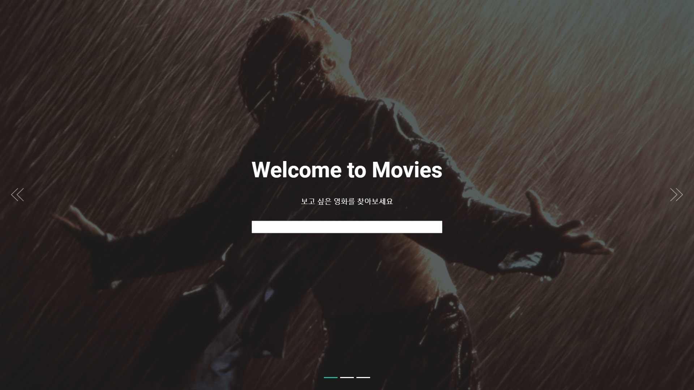
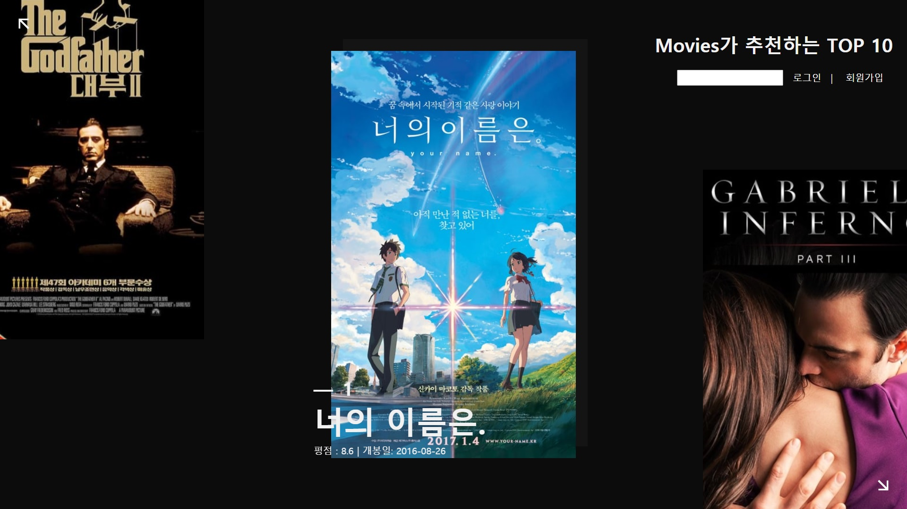

# SSAFY Final Project

[1. Description](#1.-Description)

[2. Installation](#2.-Installation)

## **1. Description**

> 서비스 소개

Django 기반으로 작성된 영화 리뷰 및 추천 기능을 담은 커뮤니티 사이트

커뮤니티 기능

- 계정 생성, 조회, 수정, 삭제 기능(CRUD)
  - 다른 이용자 follow 기능
- 영화별로 리뷰 작성, 조회, 수정, 삭제
- 각 리뷰 별로 코멘트 및 추천 작성 가능

영화 추천 기능

- 영화 상세 정보 조회
  - 영화 줄거리, 포스터, 다른 이용자의 리뷰, 예고편(Youtube API) 제공
- 본인이 남긴 리뷰 기반 장르별 영화 추천
  - 사용자가 리뷰를 많이 남긴 장르의 영화를 TMDB 별점순으로 정렬하여 제공

## 2. Installation

> 구현된 웹 사이트를 보기 위해 설치가 필요한 항목 소개

### 2.1. Used Module

Bootstrap4

django-imagekit

requests

### 2.2. Browser Support

